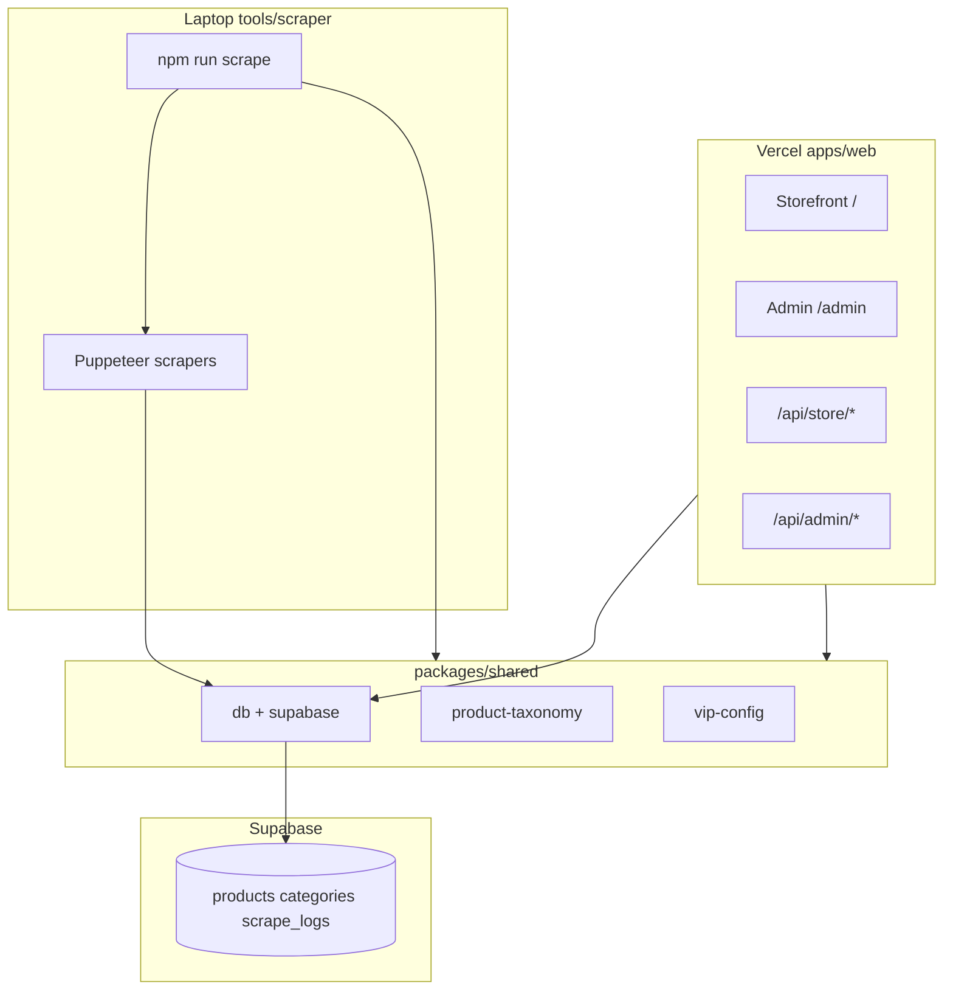

# Architecture

## Overview

## Packages

### `@luxe/web` (`apps/web`)

- Next.js 16 App Router
- Storefront publik + admin panel
- **Tidak** memuat Puppeteer — aman untuk Vercel serverless
- Web-only libs di `apps/web/lib/`: `storefront`, `supabase/server`, `supabase/client`, `wishlist`

### `@luxe/scraper` (`tools/scraper`)

- CLI `npm run scrape` — entry point `tools/scraper/bin/scrape.mjs`
- Scrapers VIP: Banananina, ZetaBags, HuntStreet, Yoogi's Closet
- Menulis langsung ke Supabase via `@luxe/shared/db`

### `@luxe/shared` (`packages/shared`)

- `vip-config` — sources, brands, category tree
- `product-taxonomy` — resolve category slug dari title/URL
- `category-seed` — ensure VIP category rows di DB
- `db` — insert/update products, scrape sessions, dedupe, sold-out sweep
- `scrape-targets` — curated scrape jobs untuk admin UI

## Data flow — scrape

1. Operator jalankan CLI di laptop (atau copy dari `/admin/scraper`)
2. CLI buat `scrape_logs` session
3. Puppeteer scrape listing → validasi produk
4. `insertProducts()` upsert by `source_url`
5. Optional: sold-out sweep + dedupe
6. Storefront Vercel baca data yang sama dari Supabase

## Backward compatibility

Folder `utils/` di root masih ada sebagai **re-export** ke `packages/shared` agar script lama (`scripts/*.mjs`) tetap jalan tanpa perubahan import.

Folder `app/` lama di root dipertahankan sementara; `npm run dev` sekarang menjalankan `apps/web`.
